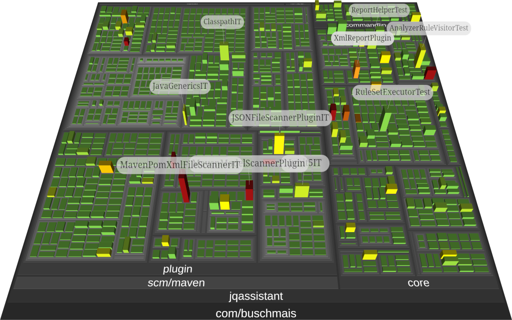

= jQAssistant CodeCharta Plugin

This is the https://codecharta.com//[CodeCharta^] plugin for https://jqassistant.org[jQAssistant^].

It provides the capability to export `cc.json` reports to visualize code structures and metrics in CodeCharta.

NOTE: The reports are currently limited to Java projects.

For more information on jQAssistant see https://jqassistant.org[^].

== Usage

=== Configuration

- Create a file `.jqassistant.yml` (or extend an existing one) in your project directory
- Declare the CodeCharta plugin and the report to be executed during `analyze`

[source,yaml]
..jqassistant.yml
----
jqassistant:
  plugins:
    - group-id: org.jqassistant.plugin  #(1)
      artifact-id: jqassistant-codecharta-plugin
      version: ${jqassistant.codecharta-plugin.version}
  analyze:
    concepts:
      - codecharta-java:TypeReport #(2)
----
<1> Declaration of the jQAssistant CodeCharta plugin
<2> Activation of the CodeCharta report for Java projects

=== Maven

If jQAssistant is already configured in your pom.xml (including scan & analyze) then just run:

----
mvn verify -DskipTests
----

Otherwise, build the project and execute the goals of the jQAssistant Maven plugin directly:

----
mvn test-compile com.buschmais.jqassistant:jqassistant-maven-plugin:scan com.buschmais.jqassistant:jqassistant-maven-plugin:analyze
----

TIP: In situations where Maven modules make use of extensions there might be a problem during scan ("Unable to obtain lock on file: <path>/target/jqassistant/store/data/databases/store_lock"). In this case add the parameter `-Djqassistant.maven.reuse-store=false` to the commandline and run again.

After successful execution the folder `target/jqassistant/report/codecharta` contains a file `codecharta-java_TypeReport.cc.json` which can be imported into the CodeCharta visualization.

=== CLI

https://github.com/jQAssistant/jqassistant/releases/latest[Download] the jQAssistant command line distribution, unpack it and run

----
jqassistant-commandline-neo4jv5-<version>/bin/jqassistant.sh scan -f my-war-file.war
jqassistant-commandline-neo4jv5-<version>/bin/jqassistant.sh analyze
----

The folder `jqassistant/report/codecharta` contains a file `codecharta-java_TypeReport.cc.json` to be imported into the CodeCharta visualization.

== Issues & Questions

If you run into problems please https://github.com/jqassistant-plugin/jqassistant-codecharta-plugin/issues[create an issue] or https://stackoverflow.com/questions/ask[ask a question on Stackoverflow] using the tag `jqassistant`.
