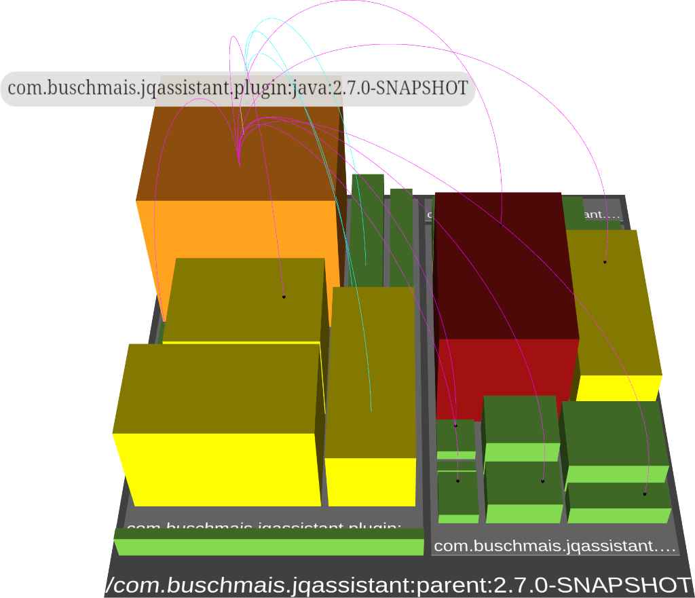

:toc:
= jQAssistant CodeCharta Plugin

This is the https://codecharta.com//[CodeCharta^] plugin for https://jqassistant.org[jQAssistant^].

It provides the capability to export `cc.json` reports to visualize code structures and metrics in CodeCharta.

*Java types*::
+
image::codecharta-java.png[Java,50%, 50%]
* _rloc_ (real lines of code) _complexity_, _fanIn_ and _fanOut_ as node metrics
* _coupling_ and _totalCoupling_ to other types as edge metrics

*Maven modules*::
+

* aggregated _rloc_ (real lines of code) _complexity_, _fanIn_ and _fanOut_ as node metrics
* aggregated _coupling_ and _totalCoupling_ to other Maven modules as edge metrics

The plugin is designed it allow easy <<customization>>:

* Add custom metrics to existing reports
* Create custom reports on any tree structure providing metrics

== Usage

=== Configuration

- Create a file `.jqassistant.yml` (or extend an existing one) in your project directory
- Declare the CodeCharta plugin and the reports to be executed during `analyze`

[source,yaml]
..jqassistant.yml
----
jqassistant:
  plugins:
    - group-id: org.jqassistant.plugin  #(1)
      artifact-id: jqassistant-codecharta-plugin
      version: 1.0.0-M1
  analyze:
    concepts:
      - codecharta-java:TypeReport #(2)
      - codecharta-java:MavenReport #(3)
----
<1> Declaration of the jQAssistant CodeCharta plugin
<2> Activates the CodeCharta report for Java types
<3> Activates the CodeCharta report for Maven modules

=== Maven

If jQAssistant is already configured in your pom.xml (including scan & analyze) then just run:

----
mvn verify -DskipTests
----

Otherwise, build the project and execute the goals of the jQAssistant Maven plugin directly:

----
mvn test-compile com.buschmais.jqassistant:jqassistant-maven-plugin:scan com.buschmais.jqassistant:jqassistant-maven-plugin:analyze
----

TIP: In situations where Maven modules make use of extensions there might be a problem during scan ("Unable to obtain lock on file: <path>/target/jqassistant/store/data/databases/store_lock"). In this case add the parameter `-Djqassistant.maven.reuse-store=false` to the commandline and run again.

After successful execution the folder `target/jqassistant/report/codecharta` contains a file `codecharta-java_TypeReport.cc.json` which can be imported into the CodeCharta visualization (e.g. https://codecharta.com/visualization/app/[WebStudio]).

=== CLI

https://github.com/jQAssistant/jqassistant/releases/latest[Download] the jQAssistant command line distribution, unpack it and run

----
jqassistant-commandline-neo4jv5-<version>/bin/jqassistant.sh scan -f my-war-file.war
jqassistant-commandline-neo4jv5-<version>/bin/jqassistant.sh analyze
----

The folder `jqassistant/report/codecharta` contains the files `codecharta-java_TypeReport.cc.json` and `codecharta-java_MavenReport.cc.json` to be imported into the CodeCharta visualization (e.g. https://codecharta.com/visualization/app/[WebStudio]).

[[customization]]
== Customization

=== Additional Java metrics

The Java type metrics can be extended by providing an additional concept to the pre-defined concept `codecharta-java:TypeReport`.

Just add a file `my-project.xml` to the directory `<working directory>/jqassistant`:

[source,xml]
.jqassistant/my-project.xml
----
<jqassistant-rules xmlns="http://schema.jqassistant.org/rule/v2.2"
xmlns:xsi="http://www.w3.org/2001/XMLSchema-instance"
xsi:schemaLocation="http://schema.jqassistant.org/rule/v2.2 https://jqassistant.github.io/jqassistant/current/schema/jqassistant-rule-v2.2.xsd">

    <concept id="my-project:CustomTypeMetrics">
        <providesConcept refId="codecharta-java:TypeReport"/>
        <requiresConcept refId="codecharta-java:TypeMetrics"/>
        <description>Provides the count of public methods per Java type (including inner types) as node metric.</description>
        <cypher><![CDATA[
            MATCH
              (nodeMetrics:CodeCharta:Node:Metrics)-[:AGGREGATES]->(type:Type)-[:DECLARES]->(publicMethod:Method{visibility:"public"})
            WITH
              nodeMetrics, count(publicMethod) as publicMethods
            SET
              nodeMetrics.publicMethods = publicMethods
            RETURN
              count(nodeMetrics) AS NodeMetrics
            ]]></cypher>
        <verify>
            <aggregation/>
        </verify>
    </concept>
</jqassistant-rules>
----

This concept will be activated automatically during `analyze`.

== Issues & Questions

If you run into problems please https://github.com/jqassistant-plugin/jqassistant-codecharta-plugin/issues[create an issue] or https://stackoverflow.com/questions/ask[ask a question on Stackoverflow] using the tag `jqassistant`.
