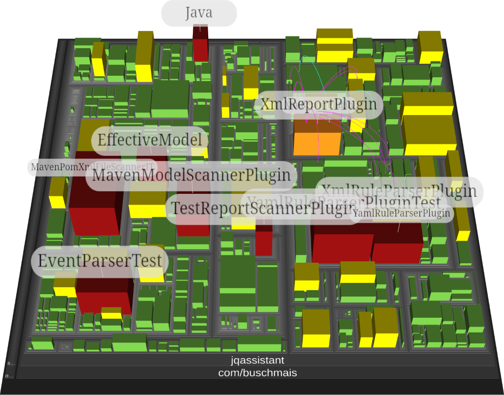

:toc:
= jQAssistant CodeCharta Plugin

This is the https://codecharta.com//[CodeCharta^] plugin for https://jqassistant.org[jQAssistant^].

It provides the capability to export `cc.json` reports to visualize code structures and metrics in CodeCharta on different aggregation levels.

*Java Types*::
+

*Maven Modules*::
+
image::codecharta-maven.png[Maven,50%,50%]

The following node metrics are provided for all aggregation levels:

*rloc*:: real lines of code

*complexity*:: cyclomatic complexity

*fan_in*:: count of incoming type dependencies

*fan_in_total*:: count of total incoming dependencies, e.g. method invocations, field writes/reads, etc.

*fan_out*:: count of outgoing type dependencies

*fan_out_total*:: count of total outgoing dependencies, e.g. method invocations, field writes/reads, etc.

*number_of_commits*:: number of Git commits

*number_of_author*:: number of Git authors

Furthermore, the following edge metrics are provided for all aggregation levels:

*coupling*:: count of type dependencies represented by the edge

*coupling_total*:: count of total dependencies represented by the edge, e.g. method invocations, field writes/reads, etc.

The plugin allows easy and flexible <<customization, customization>>:

* Add custom metrics to existing reports
* Create custom reports on any tree structure providing metrics

== Usage

=== Configuration

- Create a file `.jqassistant.yml` (or extend an existing one) in your project directory
- Declare the CodeCharta plugin and the reports to be executed during `analyze`

[source,yaml]
..jqassistant.yml
----
jqassistant:
  plugins:
    - group-id: org.jqassistant.plugin  #(1)
      artifact-id: jqassistant-codecharta-plugin
      version: 1.0.0-M2
  scan:
    include:
      files:
        - .git #(2)
  analyze:
    concepts:
      - codecharta-java:TypeReport #(3)
      - codecharta-java:MavenProjectReport #(4)
      - codecharta-java:ArtifactReport #(5)
----
<1> Declaration of the jQAssistant CodeCharta plugin
<2> Include history from local Git repository (if available)
<3> Activates the CodeCharta report for Java types
<4> Activates the CodeCharta report for Maven projects
<5> Activates the CodeCharta report for artifacts

NOTE: The Maven project report cannot be used with the CLI as it does scan the Maven module structure.
For this case the artifact report provides a similar aggregation level but will not include module hierarchies.

=== Maven

If jQAssistant is already configured in your pom.xml (including scan & analyze) then just run:

----
mvn verify -DskipTests
----

Otherwise, build the project and execute the goals of the jQAssistant Maven plugin directly:

----
mvn test-compile com.buschmais.jqassistant:jqassistant-maven-plugin:scan com.buschmais.jqassistant:jqassistant-maven-plugin:analyze
----

TIP: In situations where Maven modules make use of extensions there might be a problem during scan ("Unable to obtain lock on file: <path>/target/jqassistant/store/data/databases/store_lock"). In this case add the parameter `-Djqassistant.maven.reuse-store=false` to the commandline and run again.

After successful execution the folder `target/jqassistant/report/codecharta` contains the report files which can be imported into the CodeCharta visualization (e.g. https://codecharta.com/visualization/app/[WebStudio]).

=== CLI

https://github.com/jQAssistant/jqassistant/releases/latest[Download] the jQAssistant command line distribution, unpack it and run

----
jqassistant-commandline-neo4jv5-<version>/bin/jqassistant.sh scan -f my-war-file.war
jqassistant-commandline-neo4jv5-<version>/bin/jqassistant.sh analyze
----

The folder `jqassistant/report/codecharta` contains the files to be imported into the CodeCharta visualization (e.g. https://codecharta.com/visualization/app/[WebStudio]).

[[customization]]
== Customization

=== Custom node metrics

Existing node metrics can be extended with additional attributes by providing a concept for the pre-defined concept `codecharta:Metrics`.

Just add a file `my-project.xml` to the directory `<working directory>/jqassistant`:

[source,xml]
.jqassistant/my-project.xml
----
<jqassistant-rules xmlns="http://schema.jqassistant.org/rule/v2.2"
xmlns:xsi="http://www.w3.org/2001/XMLSchema-instance"
xsi:schemaLocation="http://schema.jqassistant.org/rule/v2.2 https://jqassistant.github.io/jqassistant/current/schema/jqassistant-rule-v2.2.xsd">

    <concept id="my-project:CustomTypeMetrics">
        <providesConcept refId="codecharta:MetricsAttributes"/>
        <requiresConcept refId="codecharta:NodeMetricsPerAggregationLevel"/>
        <description>Provides the count of public methods per Java type (including inner types) as node metric.</description>
        <cypher><![CDATA[
            MATCH
              (nodeMetrics:CodeCharta:Node:Metrics)-[:AGGREGATES]->(type:Type)-[:DECLARES]->(publicMethod:Method{visibility:"public"})
            WITH
              nodeMetrics, count(publicMethod) as publicMethods
            SET
              nodeMetrics.publicMethods = publicMethods
            RETURN
              count(nodeMetrics) AS NodeMetrics
            ]]></cypher>
        <verify>
            <aggregation/>
        </verify>
    </concept>

</jqassistant-rules>
----

This concept will be activated automatically during `analyze`.

=== Custom Report

The plugin allows to define concepts for creating custom reports as illustrated by the example below:

[source,xml]
.jqassistant/my-project.xml
----
<jqassistant-rules xmlns="http://schema.jqassistant.org/rule/v2.2"
                   xmlns:xsi="http://www.w3.org/2001/XMLSchema-instance"
                   xsi:schemaLocation="http://schema.jqassistant.org/rule/v2.2 https://jqassistant.github.io/jqassistant/current/schema/jqassistant-rule-v2.2.xsd">

    <concept id="codecharta-test:CustomReport">
        <requiresConcept refId="codecharta-java:NodeMetricsPerType"/>
        <requiresConcept refId="codecharta:MetricsAttributes"/>
        <description>Creates a custom CodeCharta report for Java types without parents and providing only node metrics.</description>
        <cypher><![CDATA[
            MATCH
              (node:Java:Type)-[:HAS_METRICS]->(nodeMetrics:CodeCharta:Metrics)
            RETURN
              node AS Node, nodeMetrics AS NodeMetrics
            ]]></cypher>
        <report type="codecharta"/>
    </concept>

</jqassistant-rules>
----

The result of a CodeCharta report may contain the following columns:

[option=headers]
|===
| Column | Description | Required

| Node
| The node to be visualized
| yes

| NodeLabel
| The label of the node to render
| no

| ParentNode
| The parent node of the node in the `Node` column.
| no

| NodeMetrics
| The node metrics, represented either by a node with the labels `:Node:Metrics` having properties as key/value pairs representing metric attributes. Alternatively a map structure `{ attribute1: value1, attribute2: value2 }` can be returned directly.
| yes

| EdgeMetrics
| List of edge metrics from this node to other nodes, represented by an array of `HAS_EDGE_METRICS` relationships having properties as key/value pairs representing metric attributes and connecting `:Node:Metrics` nodes, i.e. +
`(:Node:Metrics)-[:HAS_EDGE_METRICS]->(:Node:Metrics)`

| no

|===

NOTE: Each parent node must be represented as `Node` in a separate row of the result to form the tree structure. Furthermore, an< node metrics provided for them are ignored. Nodes referenced with `to` in edge metrics must be part of the result as well.

A full return clause typically looks as follows:

[source,cypher]
----
  MATCH
    ...
  RETURN
    node AS Node, node.name AS NodeLabel, parentNode AS ParentNode, nodeMetrics AS NodeMetrics, collect(edgeMetrics) as EdgeMetrics
----

For full examples refer to the concepts `codecharta-java:TypeReport` or `codecharta-java:MavenReport` in the file link:src/main/resources/META-INF/jqassistant-rules/codecharta-java.xml[codecharta-java.xml].

=== Custom Aggregation Level

Existing aggregation levels can be extended by custom aggregation levels representing specifc elements of the application architecture, e.g. `Bounded Contexts` or `Modules`. All existing metrics are automatically calculated for such aggregations.

The example below illustrates an example for adding an aggregation level for modules provided by https://spring.io/projects/spring-modulith[Spring Modulith]:

[source,xml]
.jqassistant/my-project.xml
----
<jqassistant-rules xmlns="http://schema.jqassistant.org/rule/v2.2"
                   xmlns:xsi="http://www.w3.org/2001/XMLSchema-instance"
                   xsi:schemaLocation="http://schema.jqassistant.org/rule/v2.2 https://jqassistant.github.io/jqassistant/current/schema/jqassistant-rule-v2.2.xsd">

    <concept id="my-project:Module"> <!--1-->
        <description>Labels packages representing Spring Modulith Modules with :Spring:Modulith:Module .</description>
        <cypher><![CDATA[
            MATCH
              (applicationPackage:Package)-[:CONTAINS]->(:Type)-[:ANNOTATED_BY]->()-[:OF_TYPE]->(:Type{fqn:"org.springframework.modulith.Modulithic"}),
              (applicationPackage)-[:CONTAINS]->(modulePackage:Package)
            SET
              modulePackage:Spring:Modulith:Module
            RETURN
              modulePackage as Module
        ]]></cypher>
    </concept>

    <concept id="my-project:NodeMetricsPerModule"> <!--2-->
        <providesConcept refId="codecharta:NodeMetricsPerAggregationLevel"/>
        <requiresConcept refId="my-project:Module"/>
        <requiresConcept refId="java:GeneratedType"/>
        <description>Provides node metrics for packages representing Spring Modulith modules.</description>
        <cypher><![CDATA[
            MATCH
              (module:Spring:Modulith:Module)-[:CONTAINS*]->(type:Java:Type)
            WHERE NOT
              type:Generated
            WITH
              module, type
            MERGE
              (module)-[:HAS_METRICS]->(nodeMetrics:CodeCharta:Node:Metrics{aggregationLevel:":Spring:Modulith:Module"})
            MERGE
              (nodeMetrics)-[:AGGREGATES]->(type)
            RETURN
              nodeMetrics.aggregationLevel as AggregationLevel, count(nodeMetrics) AS NodeMetrics
        ]]></cypher>
    </concept>

    <concept id="my-project:ModuleReport"> <!--3-->
        <requiresConcept refId="my-project:NodeMetricsPerModule"/>
        <requiresConcept refId="codecharta:MetricsAttributes"/>
        <description>Creates a CodeCharta report for Spring Modulith modules.</description>
        <cypher><![CDATA[
            MATCH
              (node:Spring:Modulith:Module)-[:HAS_METRICS]->(nodeMetrics:CodeCharta:Node:Metrics)
            OPTIONAL MATCH
              (nodeMetrics)-[edgeMetrics:HAS_EDGE_METRICS]->(toNodeMetrics:CodeCharta:Node:Metrics)
            RETURN
              node AS Node, node.name AS NodeLabel, nodeMetrics as NodeMetrics, collect(edgeMetrics) as EdgeMetrics
            ]]></cypher>
        <report type="codecharta"/>
    </concept>

</jqassistant-rules>
----
<1> Labels Java packages as `Module`, can be used by other concepts/constraints
<2> Adds node metrics to the `Module` using the custom aggregation level `:Spring:Modulith:Module`
<3> Provides the report for the modules

== Issues & Questions

If you run into problems please https://github.com/jqassistant-plugin/jqassistant-codecharta-plugin/issues[create an issue] or https://stackoverflow.com/questions/ask[ask a question on Stackoverflow] using the tag `jqassistant`.
